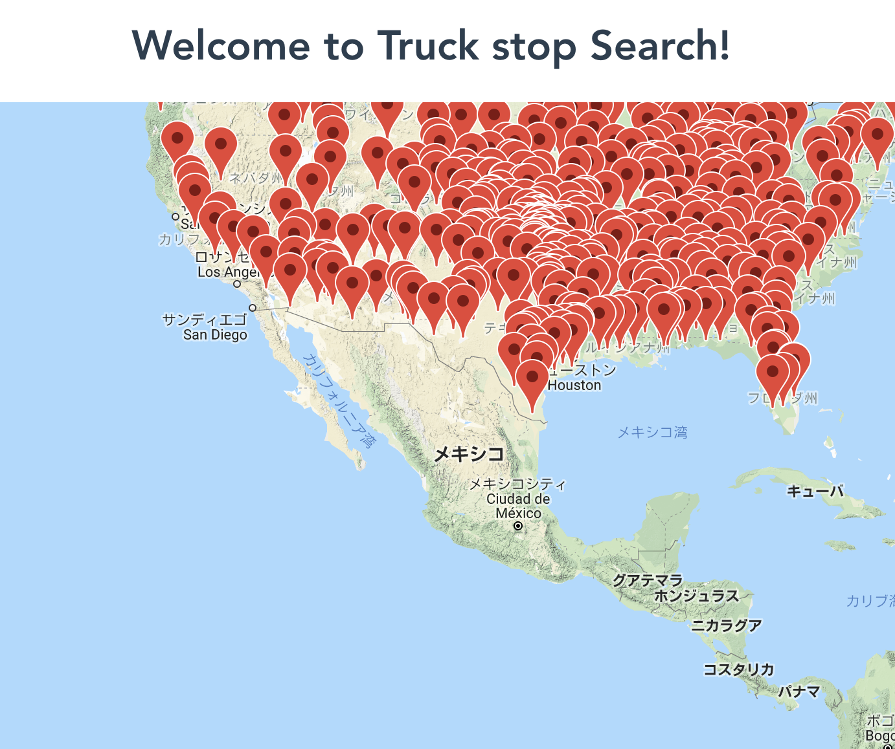
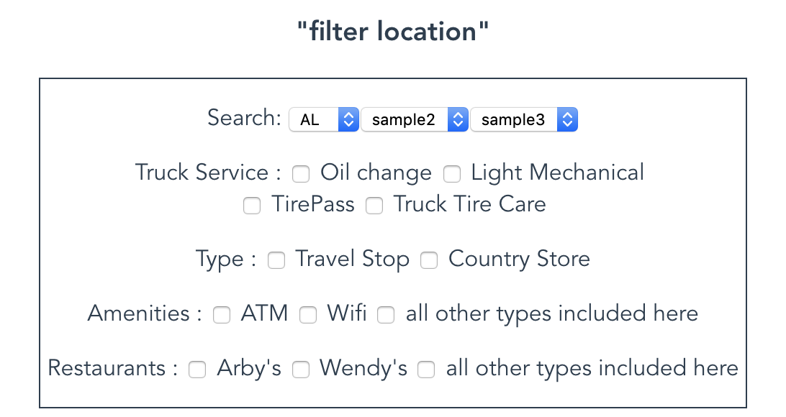

## [Solo project] cc8-project.continuous-delivery-vue-3
### This was created during my time as a [Code Chrysalis](https://codechrysalis.io) Student
- full stack project to create search website

# What we can do for user?
- user can see the map with marker of truck stop
- user can select States from dropdown in filter

# Challenge
- set up local dev/production server
- create database, insert correct data
- reflect data to filter & GoogleMap
- Show up marker on GoogleMap

# Achievement
- Created server
- Created database
- Inserted correct data
- Created Heroku database
- Inserted correct data into Heroku database
- Access data in database and apply it to dropdown
- Show up all truck stop marker on GoogleMap

# Things what I learned
- Database creattion
- Relation of files and flow of data from root to child
- async / Promise (Don't forget to apply .then!!)
- higher order function is really helpful when we deal data(map, filter, reduce etc...)

# Things what I need to remember
- When you see Observe in console.log, it is Promise!
- Don't forget 'this' when you add any data to provided space.(e.g. this.location, this.stateArray)

# Syntax/cli memo for future
- heroku database with knex execute by command line
- migrate 	: `heroku run knex migrate:latest --app <heroku app name>`
- seed		: `heroku run knex run:seed --app <heroku app name>`
- app log check	: `heroku logs --app <heroku app name>`
